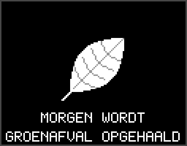
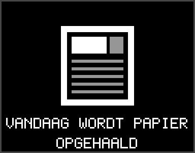
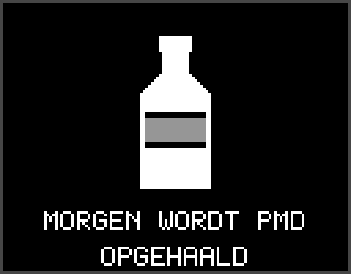
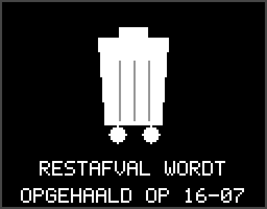
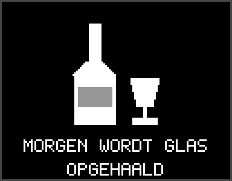

# retouch-afvalwijzer

ReTouch plugin that shows the next Dutch waste pickup on a SoundTouch 20 OLED and can announce it through the speaker.

## What it does

- Configure postcode + house number in ReTouch plugin settings.
- Fetches the upcoming pickups from Afvalwijzer-style JSON endpoints (or Ximmio providers).
- Shows a per-type icon + sentence on the OLED while the speaker is in standby
  (via ReTouch's display API; ReTouch restores the panel when music starts). By default it only shows the
  pickup day itself ("Vandaag wordt … opgehaald") and the day before ("Morgen wordt
  …"); from 18:00 the display rolls over to the next pickup day. The "always show"
  toggle shows the next pickup days ahead instead.
- Spoken announcements at configured times (e.g. `08:00,18:30`) via Google TTS through
  the firmware's ducked `/playNotification` — music keeps playing and resumes by
  itself. `/playNotification` plays at a fixed firmware level, so the announce volume
  is a gain percentage baked into the clip (100 = TTS loudness, 0 = 100).
- UI + display texts are translated (en/nl/de/fr/es/af), following ReTouch's language.
- On models without the ST20 panel ReTouch reports the display as unavailable and
  the plugin never sends content (dates and announcements still work).

The OLED itself is owned by ReTouch: this plugin only sends content (icon name +
sentence) to the loopback display API (`/api/display/...`); ReTouch renders it,
shows it in standby, arbitrates with other plugins and restores the panel.

## Screens per waste type

| groen | papier | pmd | rest | glas |
|-------|--------|-----|------|------|
|  |  |  |  |  |

Rendering lives in ReTouch (`internal/display`); regenerate previews there with
`ICONDUMP=<dir> go test ./internal/display`.

## Plugin contract

ReTouch launches it with:

```text
--speaker-host 127.0.0.1:8090
--config-dir   <home>/plugins/afvalwijzer
--listen       127.0.0.1:<port>
--host-url     http://...:8000
```

Endpoints:

- `GET /health`
- `GET /manifest`
- `POST /action/save`
- `POST /action/refresh`
- `POST /action/test`
- `POST /action/announce`
- `POST /action/clear`

## Build

```sh
sh build.sh
```

Upload `build/retouch-afvalwijzer-armv7l` through ReTouch sideload, or install from a GitHub release (the Release workflow attaches the armv7l binary + SHA256SUMS).
